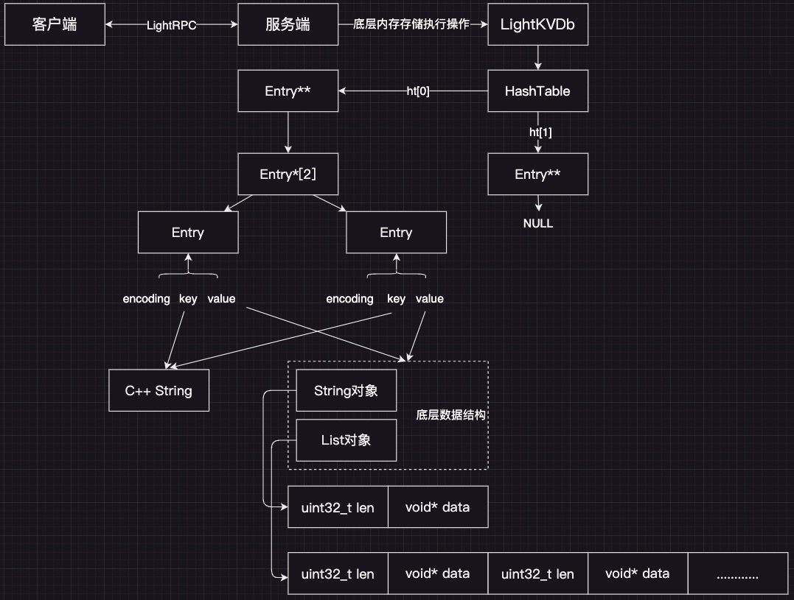

# A lightweight C++ key-value pair database（LightKV）

本项目为C++17编写的基于内存的小型键值对数据库：

* 使用自己实现的小型远程过程调用框架[LightRPC](https://github.com/gongshanchong/LightRPC)进行客户端和服务端的通信；
* 客户端支持键值对的增删改查，服务端使用读写锁实现线程安全；
* 支持RDB快照，后台线程基于自定义的数据帧格式进行持久化，服务端启动时自动加载快照；
* 使用gflags开发命令行工具kvctl，调用client的接口实现KV的增删改查；
* 参考Redis 保存键值对的结构：
  * 使用双Hash表设计，使用链式哈希解决冲突，后台线程定期计算负载因子后实现渐进rehash；
  * 使用惰性删除清理过期的键；
  * 实现了String、List对象；

## 环境配置

1. 环境要求：C++17
2. 依赖库安装：

   1. RPC配置：[LightRPC](https://github.com/gongshanchong/LightRPC)
   2. gflags

## 整体概览

